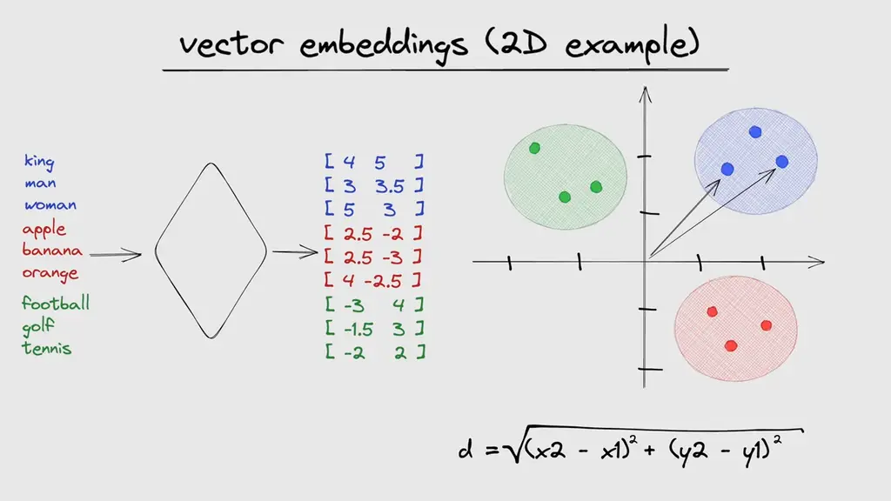

# **Unlinked**

Unlinked is a web scraper designed to identify and detect unrelated links in community-based posts, such as those on platforms like StackOverflow, Medium, and similar forums. 

## **How It Works**

Unlinked leverages vector-based similarity detection to analyze the relevance of links within a post. The core concept is built around the use of a **vector database**, which is pre-trained on a vast corpus of data. The scraper uses **spaCy**, a popular NLP library, to compute word and sentence embeddings.

In the vector space, semantically related words or sentences tend to have smaller angles between them, resulting in a high cosine similarity score. Conversely, unrelated words or sentences will have larger angles, resulting in lower or negative cosine similarity. This allows the application to determine whether links in a post are contextually related to the content or not.



## **Getting Started**

### **Running Locally**

To run Unlinked on your local machine, follow the steps below:

1. Clone the repository:
    ```bash
    git clone https://github.com/Aashish1-1-1/Unlinked
    ```

2. Navigate to the project directory:
    ```bash
    cd Unlinked/unlinked
    ```

3. Build the Docker image:
    ```bash
    sudo docker build -t unlinked .
    ```

4. Run the application:
    ```bash
    sudo docker run -i unlinked
    ```


